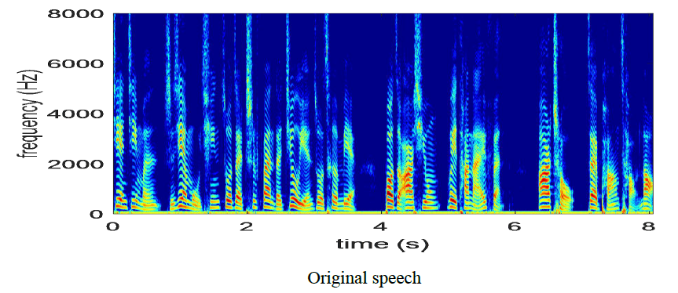
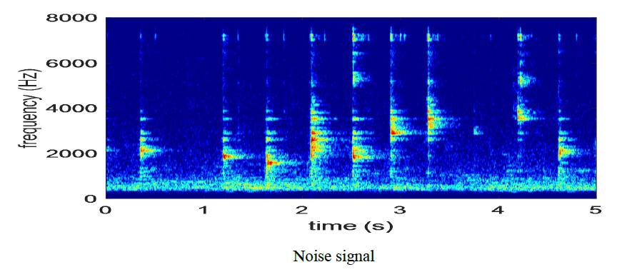
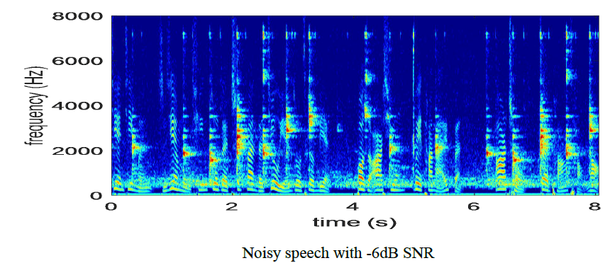
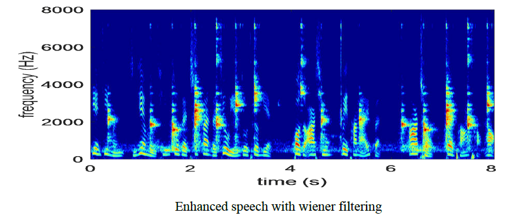
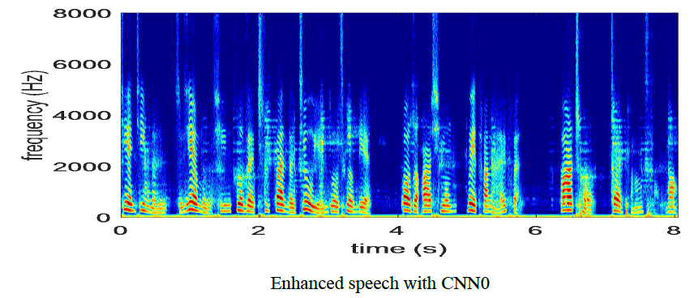
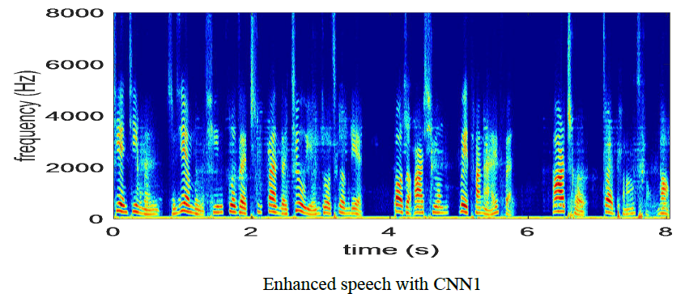
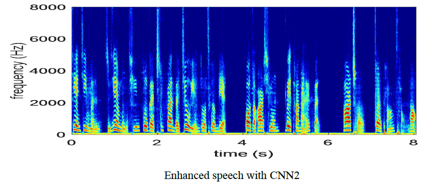

# Effects-of-Skip-Connections-in-CNN-based-Architectures-for-Speech-Enhancement
/**********************************************************************************************************************************/

This document includes some samples and the relative spetrograms processed by NN-based systems.
- Author:  Yupeng Shi, Nengheng Zheng, Yuyong Kang, Weicong Rong
- e-mail:  szucieer@gmail.com
- Date: 05/12/2019

/*********************************************************************************************************************************/

# Speech enhancement based deep neural networks (e.g., CNN)
This project is a Python implementation to investigate on the effects of skip connections applied in CNN structures.
## samples description
    clean: the clean speech
    seen_noise: 16 noise types used in the training stage.
    unseen_noise: 4 noise types excluded in the training stage 
    seen_nosiy:  the noisy speech corrupted by the seen noises 
    seen_enhanced: 
                  CNN0: the denoised speech enhanced by CNN0 
                  CNN1: the denoised speech enhanced by CNN1 
                  CNN2: the denoised speech enhanced by CNN2 
                  wiener: the denoised speech enhanced by a parametric Wiener filtering
    unseen_noisy: the noisy speech corrupted by the unseen noises 
    unseen_enhanced: 
                  CNN0: the denoised speech enhanced by CNN0 
                  CNN1: the denoised speech enhanced by CNN1 
                  CNN2: the denoised speech enhanced by CNN2 
                  wiener: the denoised speech enhanced by a parametric Wiener filtering
## some spectrograms
**clean speech**

**noise**

**noisy speech**

**Wiener filtering enhanced**

**CNN0 enhanced**

**CNN1 enhanced**

**CNN2 enhanced**
    
 
        
## future works
The relative codes will be uploaded soon.

## References
[1] Y. P. Shi, W. C. Rong, and N. H. Zheng, "Speech enhancement using convolutional neural network with skip connections,"in *the 11th international symposium on Chi-nese spoken language processing (ISCSLP)*, 2018.

[2] N. H. Zheng, Y. P. Shi, W. C. Rong, and Y. Y. Kang, "Effects of Skip Connections in CNN-based Architectures for Speech Enhancement," accpeted by *Journal of Signal Processing Systems*, 2019.

  

